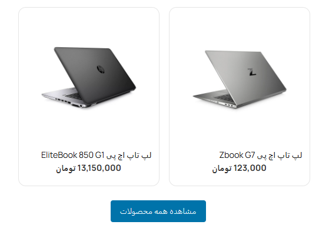

 ## نمایش محصولات با شورت‌کد در مقالات وردپرس

<p align="center">
  
</p>

## توضیحات
این پلاگین به شما اجازه می‌دهد تا با استفاده از شورت‌کد `[article_product id="1,2"]` محصولات دلخواه خود را در بین مقالات نمایش دهید. هر محصول شامل تصویر، عنوان و قیمت است و دکمه‌ای برای مشاهده همه محصولات نیز نمایش داده می‌شود.

## ویژگی‌ها
- نمایش حداکثر دو محصول انتخابی در هر مقاله
- نمایش تصویر، عنوان و قیمت محصول
- دکمه "مشاهده همه محصولات"
- استایل اختصاصی و قابل ویرایش

## نحوه استفاده

1. پلاگین را در مسیر `wp-content/plugins` آپلود و فعال کنید.
2. شورت‌کد زیر را در محتوای مقاله قرار دهید:
   ```
   [article_product id="1,2"]
   ```
   به جای 1 و 2، آیدی محصولات مورد نظر را وارد کنید.

## سفارشی‌سازی استایل
فایل CSS پلاگین در مسیر `assets/css/article-products.css` قرار دارد و قابل ویرایش است.

---

# Article Products (English)

Display selected products in WordPress articles using a simple shortcode.

## Features
- Show up to two selected products per post
- Display product image, title, and price
- "View All Products" button
- Customizable CSS

## Usage

1. Upload and activate the plugin in `wp-content/plugins`.
2. Use the shortcode in your post content:
   ```
   [article_product id="1,2"]
   ```
   Replace 1,2 with your product IDs.

## Custom CSS
Edit the plugin’s CSS file at `assets/css/article-products.css` for styling.

---

**Author:** Zahra Norouzi  
**Version:** 1.0


